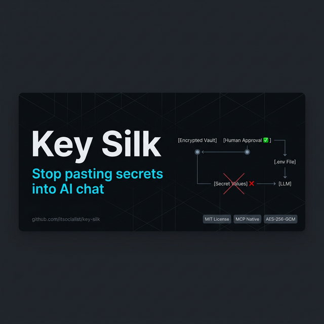
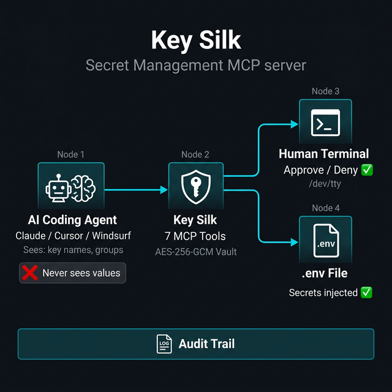
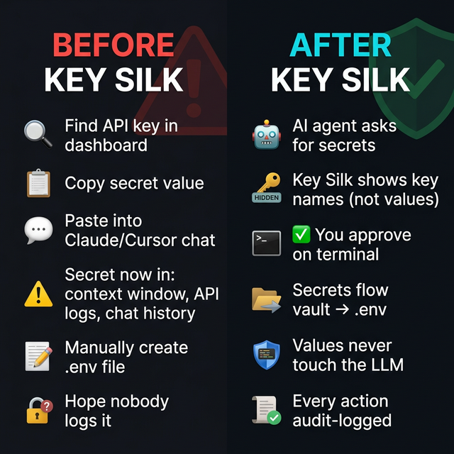
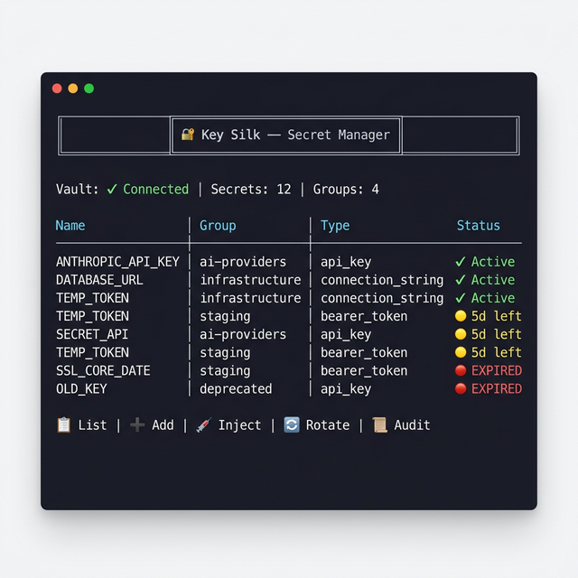

<p align="center">
  
</p>

<h1 align="center">Key Silk</h1>

<p align="center">
  <strong>Stop pasting secrets into AI chat.</strong><br/>
  <sub>Secure, human-in-the-loop secret management for AI-assisted development.</sub>
</p>

<p align="center">
  <a href="#-quick-start">Quick Start</a> •
  <a href="#-how-it-works">How It Works</a> •
  <a href="#-interfaces">Interfaces</a> •
  <a href="#-security-model">Security</a> •
  <a href="#-mcp-tools">MCP Tools</a> •
  <a href="#-development">Development</a>
</p>

<p align="center">
  
  
  
  = 18" />
  
</p>

<br/>

<p align="center">
  
</p>

<br/>

---

Key Silk is a [Model Context Protocol (MCP)](https://modelcontextprotocol.io) server that gives AI coding agents the ability to inject secrets into your projects — **without ever exposing secret values to the LLM**.

> **The problem:** Every time you paste an API key into Claude, Cursor, or Copilot, that secret enters the context window, API logs, and chat history. Key Silk eliminates this by keeping values in an encrypted vault and only exposing metadata (key names, groups, types) to the AI agent. Injection requires human approval on your terminal.

<br/>

## 🔐 How It Works

<p align="center">
  
</p>

<details>
<summary><strong>Text diagram (accessible version)</strong></summary>

```
┌──────────────┐     metadata only      ┌──────────────┐
│   AI Agent   │ ◄──────────────────── │   MCP Server  │
│  (Claude,    │    "ANTHROPIC_API_KEY  │  (Key Silk)   │
│   Cursor,    │     exists in group    │               │
│   etc.)      │     'ai-providers'"    │               │
└──────┬───────┘                        └───────┬───────┘
       │                                        │
       │  "Please inject ai-providers            │
       │   into /project/.env"                  │
       │                                        │
       ▼                                        ▼
┌──────────────┐                        ┌──────────────┐
│   Human      │ ◄── approval prompt ── │  Encrypted   │
│   Terminal   │ ──── approved keys ──► │  Vault       │
└──────────────┘                        └──────┬───────┘
                                               │
                                               ▼
                                        ┌──────────────┐
                                        │  .env file   │
                                        │  (0600 perms)│
                                        └──────────────┘
```

</details>

<br/>

<p align="center">
  
</p>

<br/>

<table>
<tr>
<td width="25%" align="center">
🔒<br/><strong>Zero Exposure</strong><br/><sub>Secret values <em>never</em> enter the LLM context window</sub>
</td>
<td width="25%" align="center">
✋<br/><strong>Human Approval</strong><br/><sub>Every injection requires approval on your terminal</sub>
</td>
<td width="25%" align="center">
📋<br/><strong>Audit Trail</strong><br/><sub>Append-only log of every operation, including denials</sub>
</td>
<td width="25%" align="center">
🔑<br/><strong>AES-256-GCM</strong><br/><sub>PBKDF2 key derivation with 600K iterations</sub>
</td>
</tr>
</table>

<br/>

---

## 🚀 Quick Start

```bash
# 1. Install
git clone https://github.com/itsocialist/key-silk.git
cd key-silk && npm install && npm run build && npm link

# 2. Initialize vault
key-silk init                               # prompted for passphrase

# 3. Add secrets
export MCP_VAULT_PASSPHRASE="your-passphrase"
key-silk add ANTHROPIC_API_KEY -t api_key -g ai-providers
key-silk add DATABASE_URL -t other -g infrastructure

# 4. Inject into a project
key-silk inject -g ai-providers --target /path/to/project/.env

# 5. Launch the interactive dashboard
key-silk                                    # TUI launches by default

# 6. Connect to your AI agent (MCP)
key-silk serve                              # stdio transport for Claude/Cursor
```

<details>
<summary><strong>MCP client configuration (Claude Desktop, Cursor, etc.)</strong></summary>

```json
{
  "mcpServers": {
    "key-silk": {
      "command": "key-silk",
      "args": ["serve"],
      "env": {
        "MCP_VAULT_PASSPHRASE": "your-passphrase"
      }
    }
  }
}
```

</details>

<br/>

---

## 🖥️ Interfaces

Key Silk provides **three interfaces** optimized for different workflows:

### Interactive Dashboard (TUI)

Run `key-silk` with no arguments to launch the full interactive experience:

<p align="center">
  
</p>

- Color-coded tables with expiration status — ✓ Active, 🟡 Expiring, 🔴 Expired
- Menu-driven workflows for every vault operation
- `.gitignore` safety warnings during injection
- Template selection for `.env` file generation

### CLI (Direct Commands)

Fast, scriptable commands for automation and CI:

```bash
key-silk list                                     # show all secrets
key-silk add API_KEY -t api_key -g prod           # add interactively
key-silk inject -g prod --target .env             # inject to file
key-silk rotate API_KEY                           # rotate a secret
key-silk audit -k API_KEY                         # query audit trail
key-silk expiring -d 14                           # check expirations
```

### MCP Server (AI Agent Interface)

Runs as a headless MCP server for AI coding assistants:

```bash
key-silk serve                       # stdio (default — Claude, Cursor)
key-silk serve --transport sse       # SSE for remote agents
```

<br/>

---

## 📋 CLI Reference

| Command | Description |
|---|---|
| `key-silk` | Launch interactive TUI dashboard |
| `key-silk init [--backend <type>]` | Initialize a new vault |
| `key-silk add <key> [opts]` | Add a secret interactively |
| `key-silk list` \| `ls` `[-g group]` | List secret metadata (never shows values) |
| `key-silk groups` | List all secret groups |
| `key-silk remove` \| `rm` `<key>` | Remove a secret |
| `key-silk rotate <key>` | Rotate (update) a secret's value |
| `key-silk inject -g <group> --target <path>` | Inject secrets to a `.env` file |
| `key-silk expiring [-d days]` | Show secrets expiring soon |
| `key-silk audit [-k key] [-a action]` | View the audit trail |
| `key-silk templates` | List available `.env` templates |
| `key-silk serve [--transport stdio\|sse]` | Start the MCP server |
| `key-silk tui` | Launch interactive TUI |

<details>
<summary><strong>Add Options</strong></summary>

```bash
key-silk add <KEY> \
  -t, --type <type>         # api_key, client_id, client_secret, oauth_token, other
  -g, --group <groups>      # Comma-separated groups
  -d, --description <desc>  # Human-readable description
  -e, --expires <date>      # ISO 8601 expiration date
```

</details>

<details>
<summary><strong>Inject Options</strong></summary>

```bash
key-silk inject \
  -g, --group <group>       # Group to inject
  --target <path>           # Target .env file path
  --template <name>         # Template name (default, nextjs, node-api, etc.)
  --overwrite               # Overwrite existing keys
```

</details>

<br/>

---

## 🤖 MCP Tools

When running as an MCP server, Key Silk exposes 7 tools to AI agents:

| Tool | Description | Human Approval |
|---|---|---|
| `secret_list_groups` | List available secret groups | — |
| `secret_list` | List secrets (metadata only, with expiration warnings) | — |
| `secret_inject` | Inject secrets to `.env` | ✅ Required |
| `secret_remove` | Remove a secret | ✅ Required |
| `secret_rotate` | Rotate a secret (new value entered via terminal) | ✅ Required |
| `secret_audit` | Query the audit trail | — |
| `secret_expiring` | List secrets nearing expiration | — |

> **Security contract:** Secret values are never returned in tool responses. The AI agent sees key names, groups, types, and expiration dates — never the actual secret values.

<br/>

---

## 🗄️ Vault Backends

Key Silk supports pluggable vault backends — use whatever fits your workflow:

<table>
<tr>
<td width="33%" valign="top">

### 🔐 Encrypted File
**Default** — Zero dependencies
```bash
key-silk init --backend encrypted-file
```
AES-256-GCM encrypted JSON on local disk. Perfect for solo developers.

</td>
<td width="33%" valign="top">

### 🔑 1Password CLI
**Team** — Leverage existing vault
```bash
export MCP_VAULT_BACKEND=onepassword
export MCP_1PASSWORD_VAULT=Development
```
Delegates to `op` CLI. Key Silk becomes the MCP bridge.

</td>
<td width="33%" valign="top">

### ☁️ Doppler
**Platform** — Cloud-native
```bash
export MCP_VAULT_BACKEND=doppler
export MCP_DOPPLER_PROJECT=my-project
export MCP_DOPPLER_CONFIG=dev
```
Integrates with Doppler's API.

</td>
</tr>
</table>

Same CLI. Same MCP tools. Same audit trail. Different vault — **your choice**.

<br/>

---

## 📄 Templates

Key Silk ships with `.env` templates for common project types:

| Template | Use Case |
|---|---|
| `default` | General-purpose starter |
| `anthropic-project` | Anthropic/Claude-focused projects |
| `node-api` | Express/Fastify API servers |
| `nextjs` | Next.js full-stack applications |
| `mcp-server` | MCP server projects |

```bash
# List available templates
key-silk templates

# Inject using a template as the base
key-silk inject -g ai-providers --target .env --template nextjs
```

Templates are `.env.tmpl` files — add your own in the `templates/` directory.

<br/>

---

## ⚙️ Configuration

Configure via environment variables or `~/.mcp-secrets/config.json`:

<details>
<summary><strong>All configuration options</strong></summary>

| Variable | Default | Description |
|---|---|---|
| `MCP_VAULT_PASSPHRASE` | — | Master passphrase (required for encrypted-file backend) |
| `MCP_VAULT_BACKEND` | `encrypted-file` | Backend type |
| `MCP_VAULT_PATH` | `~/.mcp-secrets/vault.enc` | Vault file location |
| `MCP_AUDIT_LOG_PATH` | `~/.mcp-secrets/audit.log` | Audit log location |
| `MCP_TRANSPORT` | `stdio` | MCP transport (stdio or sse) |
| `MCP_SSE_PORT` | `3100` | SSE transport port |
| `MCP_AUTO_APPROVE` | `false` | Enable auto-approve policies |
| `MCP_TEMPLATE_DIR` | `./templates` | Template directory |
| `MCP_EXPIRATION_WARNING_DAYS` | `7` | Expiration warning threshold |
| `MCP_1PASSWORD_VAULT` | `Development` | 1Password vault name |
| `MCP_DOPPLER_PROJECT` | — | Doppler project name |
| `MCP_DOPPLER_CONFIG` | `dev` | Doppler config environment |

</details>

<details>
<summary><strong>Auto-Approve Policies (advanced)</strong></summary>

For trusted environments, configure policies that skip interactive approval:

```json
{
  "autoApprove": true,
  "approvalPolicies": [
    {
      "name": "dev-local",
      "conditions": {
        "groups": ["dev-tools"],
        "maxSecrets": 3,
        "targetPathPattern": "/Users/*/projects/**/.env"
      }
    }
  ]
}
```

All conditions must match for auto-approval. Every auto-approved injection is still audit-logged.

</details>

<br/>

---

## 🛡️ Security Model

<table>
<tr><td>🔐 <strong>Encryption</strong></td><td>AES-256-GCM with PBKDF2 key derivation (600,000 iterations)</td></tr>
<tr><td>📁 <strong>File Permissions</strong></td><td><code>0600</code> on vault, <code>.env</code>, and audit files</td></tr>
<tr><td>🧹 <strong>Memory</strong></td><td>Key buffers zeroed after use (<code>scrubMemory()</code>)</td></tr>
<tr><td>🚫 <strong>LLM Isolation</strong></td><td><code>getSecretValues()</code> is internal-only — never exposed via MCP</td></tr>
<tr><td>✋ <strong>Approval</strong></td><td>Interactive TTY prompt via <code>/dev/tty</code> — works even under MCP stdio</td></tr>
<tr><td>📋 <strong>Audit</strong></td><td>Append-only JSON-lines log of every operation</td></tr>
<tr><td>💾 <strong>Backup</strong></td><td>Automatic <code>.bak</code> file before every vault write</td></tr>
<tr><td>⚠️ <strong>Git Safety</strong></td><td><code>.gitignore</code> check warns if target <code>.env</code> is not excluded</td></tr>
</table>

The codebase is ~2,500 lines of TypeScript, small enough to audit in an afternoon. [Read the source →](https://github.com/itsocialist/key-silk/tree/main/src)

<br/>

---

## 🧑‍💻 Development

```bash
# Install dependencies
npm install

# Run in development mode (TypeScript, no build step)
npm run dev -- <command>     # e.g., npm run dev -- list

# Run tests (22 tests)
npm test

# Build for production
npm run build

# Link globally
npm link

# Run built version
key-silk <command>
```

<br/>

---

## 📝 License

[MIT](LICENSE) — free for personal and commercial use.

---

<p align="center">
  <sub>Built with the <a href="https://modelcontextprotocol.io">Model Context Protocol</a> SDK</sub><br/>
  <sub>Made with 🔐 by <a href="https://github.com/itsocialist">@itsocialist</a></sub>
</p>
